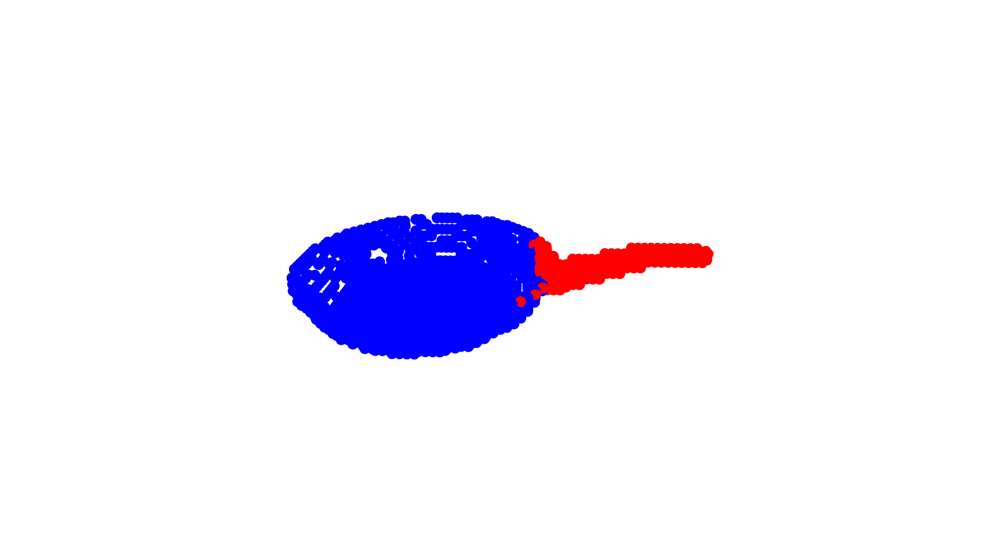
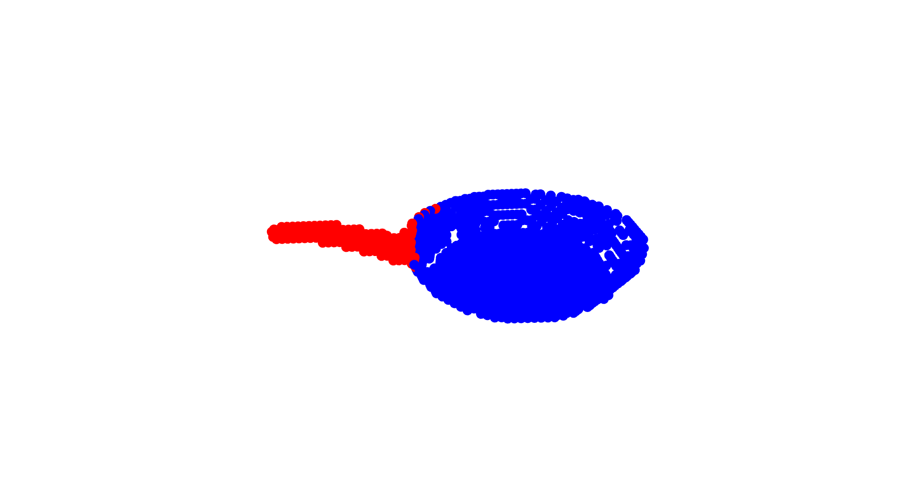

# [ContactDB: Analyzing and Predicting Grasp Contact via Thermal Imaging](https://contactdb.cc.gatech.edu)
This repository contains code to analyze and predict contact maps for human grasping, presented in the paper 

[ContactDB: Analyzing and Predicting Grasp Contact via Thermal Imaging](https://contactdb.cc.gatech.edu/) - [Samarth Brahmbhatt](https://samarth-robo.github.io/), [Cusuh Ham](https://cusuh.github.io/), [Charles C. Kemp](http://ckemp.bme.gatech.edu/), and [James Hays](https://www.cc.gatech.edu/~hays/), CVPR 2019

[Paper (CVPR 2019 Oral)](https://arxiv.org/abs/1904.06830) | [Explore the dataset](https://contactdb.cc.gatech.edu/contactdb_explorer.html) | Poster | Slides

Please see [contactdb_utils](https://github.com/samarth-robo/contactdb_utils) for access to raw ContactDB data, and code to process it; [analysis branch](https://github.com/samarth-robo/contactdb_prediction/tree/smcl) for code to generate various analysis graphs from the paper.

## Setup
1. Download and install [Miniconda](https://docs.conda.io/en/latest/miniconda.html) (Python 3.x version).
2. Download this repository: `git clone https://github.com/samarth-robo/contactdb_prediction.git`. Commands for the following steps should be executed from the `contactdb_prediction` directory.
2. Create the `contactdb_prediction` environment: `conda create env -f environment.yml`, and activate it: `source activate contactdb_prediction`.
3. Download the preprocessed contact maps from [this Dropbox link](https://www.dropbox.com/sh/x5ivxw75tvf6tax/AADXw7KRWbH3eEofbbr6NQQga?dl=0) (17.9 GB). If the download location is `CONTACTDB_DATA_DIR`, make a symlink to it: `ln -s CONTACTDB_DATA_DIR data/voxelized_meshes`.
4. Download the trained models from [this Dropbox link](https://www.dropbox.com/sh/3kvyhin9030mdzo/AAC_eYOVAvXMRhsAJsDlL_soa?dl=0) (700 MB). If the download location is `CONTACTDB_MODELS_DIR`, make a symlink to it: `ln -s CONTACTDB_MODELS_DIR data/checkpoints`.
5. (Optional, for comparison purposes): Download the predicted contact maps from [this Dropbox link](https://www.dropbox.com/sh/zrpgtoycbik0iq3/AAAHMyzs9Lc2kH8UPZttRCmGa?dl=0).

## Predicting Contact Maps
We propose two methods to make diverse contact map predictions: [DiverseNet](http://openaccess.thecvf.com/content_cvpr_2018/papers/Firman_DiverseNet_When_One_CVPR_2018_paper.pdf) and [Stochastic Multiple Choice Learning (sMCL)](https://papers.nips.cc/paper/6270-stochastic-multiple-choice-learning-for-training-diverse-deep-ensembles). This branch has code for the **sMCL models**. Checkout the [diversenet](https://github.com/samarth-robo/contactdb_prediction/tree/diversenet) branch for DiverseNet code.

Predict contact maps for the 'use' instruction, using the voxel grid 3D representation:

```
$ python eval.py --instruction use --config configs/voxnet.ini --checkpoint_dir data/checkpoints/use_voxnet_smcl_release
Loaded model from data/checkpoints/use_voxnet_smcl_release/checkpoint_model_4_71_val_loss=0.06387464.pth
Loaded model from data/checkpoints/use_voxnet_smcl_release/checkpoint_model_7_71_val_loss=0.06387464.pth
Loaded model from data/checkpoints/use_voxnet_smcl_release/checkpoint_model_0_71_val_loss=0.06387464.pth
Loaded model from data/checkpoints/use_voxnet_smcl_release/checkpoint_model_2_71_val_loss=0.06387464.pth
Loaded model from data/checkpoints/use_voxnet_smcl_release/checkpoint_model_1_71_val_loss=0.06387464.pth
Loaded model from data/checkpoints/use_voxnet_smcl_release/checkpoint_model_8_71_val_loss=0.06387464.pth
Loaded model from data/checkpoints/use_voxnet_smcl_release/checkpoint_model_6_71_val_loss=0.06387464.pth
Loaded model from data/checkpoints/use_voxnet_smcl_release/checkpoint_model_3_71_val_loss=0.06387464.pth
Loaded model from data/checkpoints/use_voxnet_smcl_release/checkpoint_model_5_71_val_loss=0.06387464.pth
Loaded model from data/checkpoints/use_voxnet_smcl_release/checkpoint_model_9_71_val_loss=0.06387464.pth
1 / 148
11 / 148
21 / 148
31 / 148
41 / 148
51 / 148
61 / 148
71 / 148
81 / 148
91 / 148
101 / 148
111 / 148
121 / 148
131 / 148
141 / 148
pan error = 0.0825
mug error = 0.3251
wine_glass error = 0.1106
```

You can also add the `--show_object <mug | pan | wine_glass>` option to show the 10 diverse predictions:
```
python eval.py --instruction use --config configs/voxnet.ini --checkpoint_dir data/checkpoints/use_voxnet_smcl_release --show_object pan
Loaded model from data/checkpoints/use_voxnet_smcl_release/checkpoint_model_4_71_val_loss=0.06387464.pth
Loaded model from data/checkpoints/use_voxnet_smcl_release/checkpoint_model_7_71_val_loss=0.06387464.pth
Loaded model from data/checkpoints/use_voxnet_smcl_release/checkpoint_model_0_71_val_loss=0.06387464.pth
Loaded model from data/checkpoints/use_voxnet_smcl_release/checkpoint_model_2_71_val_loss=0.06387464.pth
Loaded model from data/checkpoints/use_voxnet_smcl_release/checkpoint_model_1_71_val_loss=0.06387464.pth
Loaded model from data/checkpoints/use_voxnet_smcl_release/checkpoint_model_8_71_val_loss=0.06387464.pth
Loaded model from data/checkpoints/use_voxnet_smcl_release/checkpoint_model_6_71_val_loss=0.06387464.pth
Loaded model from data/checkpoints/use_voxnet_smcl_release/checkpoint_model_3_71_val_loss=0.06387464.pth
Loaded model from data/checkpoints/use_voxnet_smcl_release/checkpoint_model_5_71_val_loss=0.06387464.pth
Loaded model from data/checkpoints/use_voxnet_smcl_release/checkpoint_model_9_71_val_loss=0.06387464.pth
1 / 148
Warn: error value is not accurate, remove the --show_object flag to compute accurate error
pan error = 0.0757
```



In general, the command is

`python eval.py --instruction <use | handoff> --config <configs/voxnet.ini | configs/pointnet.ini> --checkpoint_dir <checkpoint directory>`

Use the following checkpoint directories:

|       Method       |           Checkpoint Dir      |
|:------------------:|:-----------------------------:|
|    Use - VoxNet    | use_voxnet_smcl_release       |
|   Use - PointNet   | use_pointnet_smcl_release     |
|  Handoff - VoxNet  | handoff_voxnet_smcl_release   |
| Handoff - PointNet | handoff_pointnet_smcl_release |

PointNet models will exhibit some variability in the predictions because of random sampling of points.

## Training your own models
Start the [`visdom`](https://github.com/facebookresearch/visdom) server
```
$ source activate contactdb_prediction
$ visdom
```

The base training command is

`python train_val.py --instruction <use | handoff> --config <configs/voxnet.ini | configs/pointnet.ini> [--device <GPU ID> --checkpoint_dir <directory where checkpints are saved> --data_dir <directory where data is downloaded>]`

## Citation
```
@inproceedings{brahmbhatt2018contactdb,
  title={{ContactDB: Analyzing and Predicting Grasp Contact via Thermal Imaging}},
  author={Samarth Brahmbhatt and Cusuh Ham and Charles C. Kemp and James Hays},
  booktitle={IEEE Conference on Computer Vision and Pattern Recognition (CVPR)},
  year={2019},
  note={\url{https://contactdb.cc.gatech.edu}}
}
```
